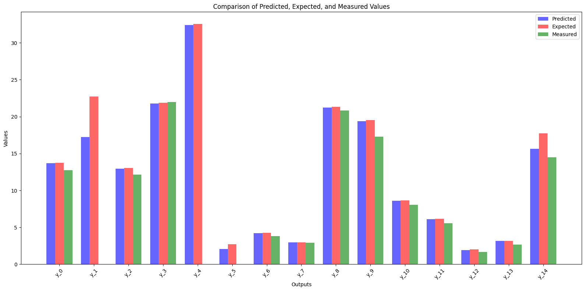

### Project Overview

This project involved a comprehensive workflow, starting with data cleaning and analysis, then progressing to exploratory data analysis (EDA) and advanced predictions. The objective was to clean the data, understand the relationships between variables, and use these insights to predict quality grades and identify optimal input values to meet specific conditions.

### Step 1 & 2: Data Cleaning and Data Analysis
The first steps required addressing potential outliers, which could arise from human errors or measurement inaccuracies. Additionally, there were missing values in the dataset. I applied appropriate data cleaning techniques to manage these issues, ensuring that the dataset was ready for further analysis. As part of this step, I also assessed the quality of the labels, noting that they might be of variable reliability.

### Step 3: Exploratory Data Analysis (EDA)
To gain a deeper understanding of the dataset, I conducted exploratory data analysis. This involved examining the relationships between different variables, identifying key trends, and uncovering potential correlations that might inform subsequent predictive tasks. EDA is crucial in setting the groundwork for building predictive models and identifying the most significant features in the dataset.

### Step 4: Predicting Quality Grades and Labels
Once the data was cleaned and analyzed, I focused on building predictive models to estimate the quality grade and label based on the sample data. This involved selecting appropriate algorithms and tuning their parameters to achieve the best possible predictive accuracy.

### Step 5: Determining Optimal Input Values
In this step, I identified the ideal values for certain inputs (denoted as x_…) to maximize a specific output (y_1) while adhering to given constraints:
- All inputs must not exceed the third quartile of current data.
- x_8 must be less than 3.15.
- x_6 must be greater than 74.

By analyzing these conditions and applying optimization techniques, I was able to suggest suitable input configurations to achieve the desired outcome.

### Part 2: Forecasting and Optimization with Industrial Data
For the second part of the project, I worked with a dataset named 'industrial_process'. This dataset contained anonymized data from a production chain, with different inputs measured at regular intervals and 15 output variables. Each output had a measured value and an expected value defined by the operator.

The task was to forecast the values of the 15 outputs over a 10-time-interval horizon. Using this forecast, I then determined which input values should be applied to ensure that the output values met the expected results. This required a combination of forecasting techniques and optimization strategies to provide actionable insights for process control in the industrial setting.

Here is the graph showing the results. On this graph we can see the expected values and the optimal values predicted in order to get closer to the expected values.
Remember that the objective was to choose the optimal variables to enter in order to get closer to the expected value.
I've also added the closest measured value (in the whole dataset) to the expected value in green. You can see that the value obtained by our prediction is always better than the best measured value (in the sense of the value closest to the expected value) in the dataset.

